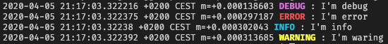

# Go-Logger

Basic library for logs, this logs are displayed with ANSI colours in linux terminals (windows yet to come).
Logs can be stored in database if configuration is provided.
Logs can be ignored with the configuration (this is usefull for diferent stages configuration)

## usage

To use this library you have to initialize it with a configuration:

example without database configuration

```javascript
config := models.Configuration{DisplayLogs: true, SaveLogs: false,
		LogLevels: models.DisplayConfiguration{
			DisplayDebug:    true,
			DisplayWarnings: true,
			DisplayError:    true,
			DisplayInfo:     true,
		},
    }
logger := logger.New(config)
```

After initialize the libreary with the configuration we can use the diferent functions provided

```javascript
logger.DEBUG("I'm debug");
logger.ERROR("I', error");
logger.INFO("I'm info");
logger.WARNING("I'm waring");
```

You can find in ./cmd/main.go an example

## Logs

### Log Example



Format: Date - type - message

### Log Types

Log Types:

- INFO : display an info message blue colour

```javascript
INFO(message string)
```

- ERROR : display an error message red colour

```javascript
ERROR(message string)
```

- WARNING : display a warning message yellow colour

```javascript
WARNING(message string)
```

- DEBUG : display a debug message purple colour

```javascript
DEBUG(message string)
```

## Database integration

Logs can be saved in a database, repository implementation have to be provided in the configuration with the Repository interface implemented
